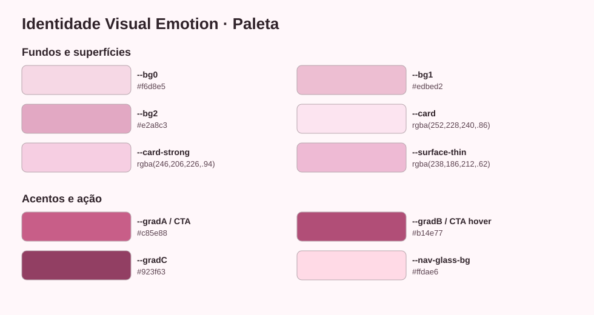

# Identidade Visual — Landing Emotion

Este documento define a base visual da landing `emotion` para manter consistência entre layout, conteúdo e futuras iterações.

## 1. Direção de Marca

- Posicionamento: acolhimento emocional, escuta profissional, segurança e proximidade.
- Sensação visual: feminina, sensível, elegante, leve.
- Princípio: contraste funcional com suavidade cromática (rosa em destaque, leitura sempre clara).

## 2. Paleta Principal

### 2.1 Fundo e superfícies

| Token | Cor |
|---|---|
| `--bg0` | `#f6d8e5` |
| `--bg1` | `#edbed2` |
| `--bg2` | `#e2a8c3` |
| `--card` | `rgba(252, 228, 240, 0.86)` |
| `--card-strong` | `rgba(246, 206, 226, 0.94)` |
| `--surface-thin` | `rgba(238, 186, 212, 0.62)` |
| `--surface-strong` | `rgba(226, 162, 194, 0.78)` |

### 2.2 Texto e contraste

| Uso | Cor |
|---|---|
| `--text` | `#2f2229` |
| `--muted` | `rgba(93, 68, 81, 0.9)` |
| Texto em CTA | `#ffffff` |

### 2.3 Acentos e gradientes

| Token/Uso | Cor |
|---|---|
| `--gradA` | `rgb(200, 94, 136)` |
| `--gradB` | `rgb(177, 78, 119)` |
| `--gradC` | `rgb(146, 63, 99)` |
| CTA `Agendar` | `#c85e88 -> #b14e77` |

### 2.4 Navbar e elementos estruturais

| Token | Cor |
|---|---|
| `--nav-glass-bg` | `#ffdae6` |
| `--nav-control-bg` | `rgba(226, 176, 201, 0.86)` |
| `--stroke` | `rgba(200, 94, 136, 0.34)` |
| `--stroke-soft` | `rgba(200, 94, 136, 0.22)` |

## 3. Tipografia

- Texto/UI: `"Source Sans 3", "Segoe UI", system-ui, Arial, sans-serif`
- Títulos: `"Cormorant Garamond", Georgia, "Times New Roman", serif`
- Peso recomendado:
- Headings: `600`
- Corpo: `400/500`
- Botões: `600`

## 4. Sistema de Componentes

## 4.1 Botão de ação (Agendar)

- Cor de fundo: rosa médio (`#c85e88`) com hover (`#b14e77`)
- Texto: branco puro (`#ffffff`)
- Borda arredondada consistente com o restante do navbar
- No mobile: largura total dentro do menu, com bom respiro vertical

## 4.2 Cards

- Fundo com rosa perceptível (não neutro/cinza)
- Gradiente suave vertical para criar profundidade sem ruído
- Borda sutil rosada (`--stroke-soft`) para separar do fundo
- Sombra leve para manter legibilidade do bloco

## 4.3 Navbar mobile

- Comportamento: abertura/fechamento por transição de `opacity + transform` (sem colapso por altura)
- Estado aberto: classe `is-open`
- Estado de saída: classe `is-closing`
- Objetivo: animação contínua e sem “tranco” no fechamento

## 5. Tom visual por seção

- Hero: contraste emocional forte com título claro e CTA direto.
- Sobre/Psicoterapia/Casal: blocos claros, texto escuro e leitura confortável.
- Agendar: maior contraste de ação, mantendo identidade rosa.

## 6. Regras de consistência

- Manter branco apenas para texto de botão e pontos de alto contraste.
- Evitar preto puro em textos; preferir os tons definidos em `--text` e `--muted`.
- Novos componentes devem reutilizar tokens existentes antes de criar novas cores.
- Em ajustes futuros, priorizar alterações em variáveis (`:root`/`html[data-niche="emotion"]`) para preservar o design system.

## 7. Referência técnica

- Arquivo-fonte principal dos estilos: `public/assets/css/landing.css`
- Escopo do tema: seletor `html[data-niche="emotion"]`
